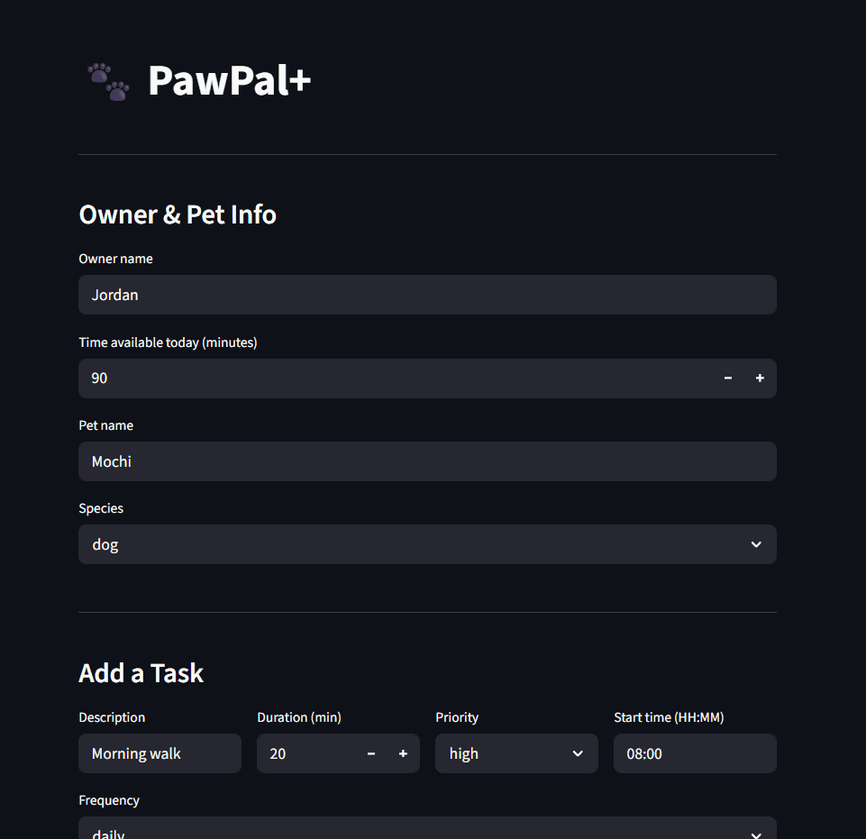
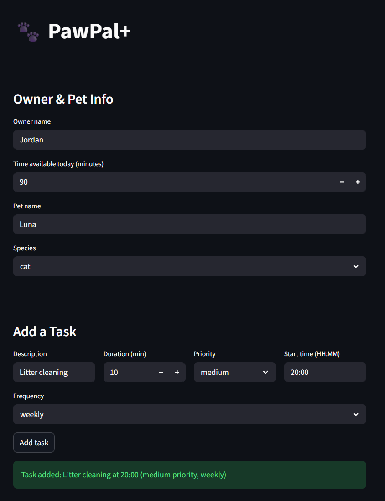
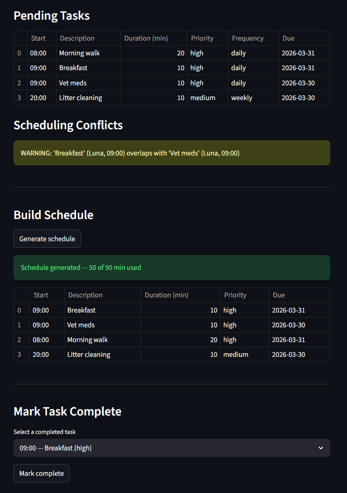

# PawPal+ (Module 2 Project)

You are building **PawPal+**, a Streamlit app that helps a pet owner plan care tasks for their pet.

## Scenario

A busy pet owner needs help staying consistent with pet care. They want an assistant that can:

- Track pet care tasks (walks, feeding, meds, enrichment, grooming, etc.)
- Consider constraints (time available, priority, owner preferences)
- Produce a daily plan and explain why it chose that plan

Your job is to design the system first (UML), then implement the logic in Python, then connect it to the Streamlit UI.

## What you will build

Your final app should:

- Let a user enter basic owner + pet info
- Let a user add/edit tasks (duration + priority at minimum)
- Generate a daily schedule/plan based on constraints and priorities
- Display the plan clearly (and ideally explain the reasoning)
- Include tests for the most important scheduling behaviors

## Demo



### Adding a task and viewing conflicts



The owner and pet info panel lets you set a daily time budget. The Add a Task form captures description, duration, priority, start time, and frequency. A green confirmation banner appears immediately after adding.

### Pending tasks, conflict warnings, and schedule



Pending tasks are displayed sorted by start time. Any time window overlaps are flagged automatically as yellow conflict warnings before the schedule is built. Clicking **Generate schedule** fills the time budget by priority and shows the selected tasks in a table.

---

## Features

### Priority-based scheduling

Tasks are ranked `high > medium > low` using a numeric mapping and selected greedily in priority order. The scheduler fills the owner's time budget from the top of that ranking, stopping when the next task no longer fits. This guarantees high-priority tasks (medication, feeding) are never bumped in favor of lower-priority ones.

### Sorting by start time

`Scheduler.sort_by_time()` returns all pending tasks in chronological order. Start times are stored as zero-padded `"HH:MM"` strings, so standard lexicographic string comparison produces correct chronological order without parsing — `"07:30" < "12:00"` works as expected.

### Conflict detection

`Scheduler.detect_conflicts()` checks every pair of pending tasks using the interval overlap formula (`start_a < end_b AND start_b < end_a`). It catches same-pet overlaps, cross-pet overlaps, and exact-same-start-time collisions. Conflicts are returned as a list of plain warning strings — the program never crashes, and the owner decides how to resolve them.

### Daily and weekly recurrence

Each task carries a `frequency` field (`"daily"`, `"weekly"`, or `"once"`). Calling `Pet.complete_task()` marks the task done and calls `Task.next_occurrence()`, which creates a new identical task with a fresh `due_date` — today + 1 day for daily, today + 7 days for weekly. Non-recurring tasks return `None` and no new task is appended.

### Due date tracking

Every task stores a `due_date` in `YYYY-MM-DD` format (defaulting to today). This lets recurring instances be distinguished from their predecessors and makes it easy to filter or display tasks by day.

### Task filtering

`Scheduler.filter_tasks(completed, pet_name)` queries the task list by completion status, by pet name, or both. Both parameters are optional — omitting them returns all tasks across all pets.

---

## Smarter Scheduling

Several features were added beyond the base scheduler to make task management more realistic:

- **Start times (`HH:MM`)** — each task carries a scheduled start time; `sort_by_time()` returns all pending tasks in chronological order using lexicographic string comparison on zero-padded times.
- **Conflict detection** — `detect_conflicts()` checks every pair of pending tasks for overlapping time windows and returns a list of warning strings without crashing the program.
- **Recurring tasks** — tasks have a `frequency` field (`"daily"` or `"weekly"`). Calling `Pet.complete_task()` marks the task done and automatically appends a new instance with a due date of today + 1 day (daily) or today + 7 days (weekly).
- **Due dates** — each task stores a `due_date` in `YYYY-MM-DD` format, defaulting to today, so recurring instances are traceable across days.
- **Filtering** — `filter_tasks(completed, pet_name)` lets you query tasks by completion status, by pet, or both.

## Testing PawPal+

### Running the tests

```bash
venv/Scripts/pytest tests/test_pawpal.py -v
```

### What the tests cover

| Group                  | What is verified                                                                                                                                                                   |
| ---------------------- | ---------------------------------------------------------------------------------------------------------------------------------------------------------------------------------- |
| **Core behavior**      | Adding tasks to a pet, marking a task complete                                                                                                                                     |
| **Sorting**            | Tasks added out of order are returned in `HH:MM` chronological order; completed tasks are excluded                                                                                 |
| **Recurrence**         | Daily tasks spawn a new instance due tomorrow; weekly tasks spawn one due in 7 days; non-recurring tasks spawn nothing; description and duration are preserved on the new instance |
| **Conflict detection** | Same start time flagged, partial overlaps flagged, cross-pet overlaps flagged, no false positives when tasks are separated                                                         |
| **Edge cases**         | Empty pet does not crash the scheduler; a task that fits the budget exactly is scheduled; a task over budget by 1 minute is excluded                                               |

### Confidence level

★★★★☆ (4/5)

The core scheduling logic, recurrence rules, and conflict detection are all covered and passing. The confidence level is 4/5 because the Streamlit UI has no automated tests, and session state bugs can only be caught manually. A UI-level tests would push this to 5/5.

## Getting started

### Setup

```bash
python -m venv .venv
source .venv/bin/activate  # Windows: .venv\Scripts\activate
pip install -r requirements.txt
```

### Suggested workflow

1. Read the scenario carefully and identify requirements and edge cases.
2. Draft a UML diagram (classes, attributes, methods, relationships).
3. Convert UML into Python class stubs (no logic yet).
4. Implement scheduling logic in small increments.
5. Add tests to verify key behaviors.
6. Connect your logic to the Streamlit UI in `app.py`.
7. Refine UML so it matches what you actually built.
